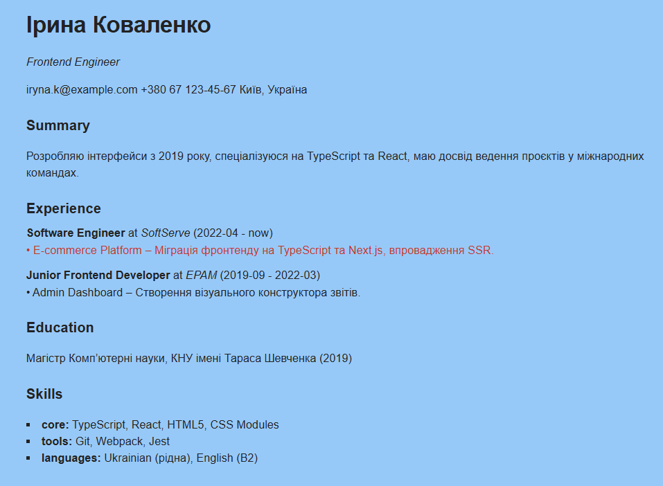

# Фінальний проєкт

# «Генератор резюме з JSON‑опису»

## Опис проекту

Проєкт генерує резюме на HTML-сторінці з єдиного джерела даних — `resume.json`. Всі стилі визначені у `src/styles.css`, і в проєкті не використовуються сторонні бібліотеки.

## Реалізовані патерни

- **Facade** — `src/facade/ResumePage.ts`
  - `ResumePage.init(jsonPath)` є єдиною точкою входу.
  - Завантажує `resume.json`, створює `ResumeImporter` і запускає імпорт даних.

- **Template Method** — `src/importer/AbstractImporter.ts` + `src/importer/ResumeImporter.ts`
  - `AbstractImporter.import()` задає послідовність: `validate()` → `map()` → `render()`.
  - `ResumeImporter` перевіряє структуру, мапить JSON у `ResumeModel` і рендерить блоки.

- **Factory Method** — `src/blocks/BlockFactory.ts`
  - `BlockFactory.createBlock(type, model)` створює потрібний блок залежно від типу.
  - Інкапсулює створення `HeaderBlock`, `SummaryBlock`, `ExperienceBlock`, `EducationBlock` та `SkillsBlock`.

- **Composite** — `src/blocks/ExperienceBlock.ts` + `src/blocks/ProjectBlock.ts`
  - `ExperienceBlock` рендерить масив досвіду та додає дочірні `ProjectBlock`.
  - `ProjectBlock` — листовий компонент, що відображає один проєкт.

- **Decorator** — `src/decorators/HighlightDecorator.ts`
  - `HighlightDecorator` обгортає `IBlock` і додає CSS-клас `highlight`.
  - Застосовується до проєктів з `isRecent: true` для червоного виділення.

## Структура проекту

```
/
├── index.html                  # Статичний макет сторінки
├── resume.json                 # Джерело даних для сторінки
├── vite.config.js              # Конфігурація Vite
├── tsconfig.json               # Конфігурація TypeScript
├── dist/                       # Директорія для збірки
└── src/
    ├── styles.css              # Базові стилі + .highlight
    ├── facade/
    │   └── ResumePage.ts       # Фасад проєкту
    ├── importer/
    │   ├── AbstractImporter.ts # Базовий Template Method
    │   └── ResumeImporter.ts   # Конкретна реалізація
    ├── blocks/                 # Конкретні блоки резюме
    │   ├── BlockFactory.ts     # Factory Method
    │   ├── HeaderBlock.ts
    │   ├── SummaryBlock.ts
    │   ├── ExperienceBlock.ts  # Composite‑контейнер
    │   ├── ProjectBlock.ts
    │   ├── EducationBlock.ts
    │   └── SkillsBlock.ts
    ├── decorators/
    │   └── HighlightDecorator.ts
    ├── models/
    │   └── ResumeModel.ts      # Типи внутрішньої моделі
    └── main.ts                 # Точка входу
```

## Запуск проекту

1. Встановлення залежностей:

   ```bash
   npm install
   ```

2. Режим розробки:

   ```bash
   npm run dev
   ```

Відкрити в браузері адресу, яку покаже Vite.



3. Збірка для продакшену:

   ```bash
   npm run build
   ```

4. Попередній перегляд збірки:
   ```bash
   npm run preview
   ```

## Як додати новий блок резюме

Щоб додати нову секцію, наприклад `Certificates`:

1. Додати типи в `src/models/ResumeModel.ts`.
2. Створити `src/blocks/CertificatesBlock.ts`, який реалізує `IBlock` і має метод `render()`.
3. Додати новий кейс у `src/blocks/BlockFactory.ts`:
   ```ts
   case 'certificates':
     return new CertificatesBlock(m.certificates);
   ```
4. Додати `'certificates'` до масиву блоків у `src/importer/ResumeImporter.ts`.
5. Додати дані для `certificates` у `resume.json`.

Після цього новий блок автоматично з’явиться на сторінці.

## Технології

- TypeScript
- Vite (збірка та розробка)
- Патерни проектування
- JSON для зберігання даних
- CSS для стилізації
